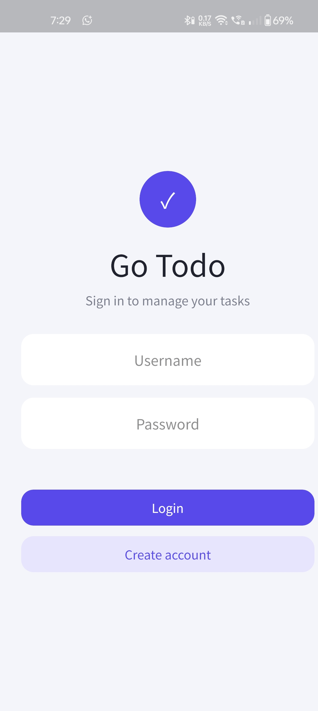
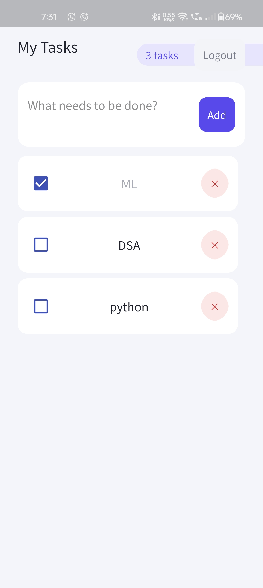

<p align="center">
  
</p>

<h1 align="center">Go Todo</h1>

<p align="center">
  <i>A minimal, native Todo app written entirely in Go</i>
</p>

<p align="center">
  <b>One language, front to back. No JS, no Electron, no bloat.</b>
</p>

<p align="center">
  
  
  
  
  
</p>

<p align="center">
  <a href="#-features">Features</a> ·
  <a href="#-screenshots">Screenshots</a> ·
  <a href="#-tech-stack">Tech Stack</a> ·
  <a href="#-project-structure">Project Structure</a> ·
  <a href="#-getting-started">Getting Started</a> ·
  <a href="#-environment">Environment</a>
</p>

---

## 🔖 About

**Go Todo** is a small full-stack task manager: a **Gio**-based native client talking to a **Gin** REST API, backed by **PostgreSQL**. Every layer — frontend, backend, and glue — is written in Go.

## 📱 Screenshots

<p align="center">
  
  &nbsp;&nbsp;&nbsp;
  
</p>

## ✨ Features

- User registration
- User login
- JWT authentication
- Create todos
- Complete todos
- Delete todos
- User-specific todos
- Logout

## 🧱 Tech Stack

| Layer          | Technology         |
|----------------|--------------------|
| Frontend       | Go + Gio           |
| Backend        | Go + Gin           |
| Database       | PostgreSQL (Neon)  |
| Authentication | JWT + bcrypt        |

## 📂 Project Structure

```text
todo-go/
├── backend/    # REST API and database
└── mobile/     # Gio application
    └── assets/ # logo.png · login.png · home.png
```

## 🚀 Getting Started

### Run Backend

```bash
cd backend
go run .
```

### Run Mobile App

```bash
cd mobile
go run .
```

The mobile app uses `http://localhost:8000` for the backend by default.

> For Android, use your computer's local network IP instead of `localhost`.

## ⚙️ Environment

Create `backend/.env` using `backend/.env.example` and configure your PostgreSQL connection and JWT secret.